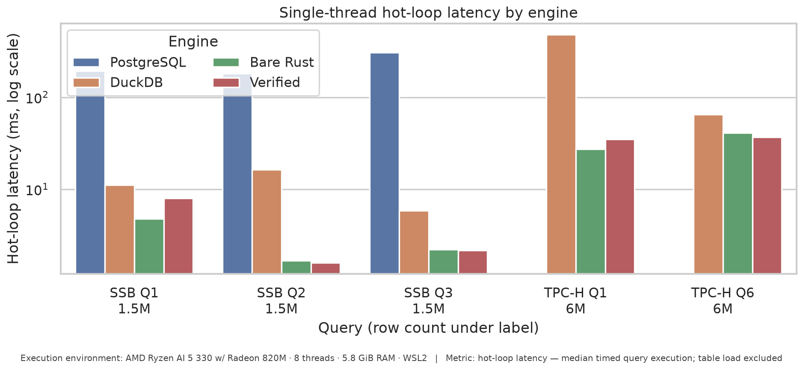

# Lemma

Verified query synthesis: SQL is transpiled to a Dafny spec, an agent (or mock) writes an optimized `RunQuery`, Dafny/Z3 proves correctness, and the result is compiled to native Rust. Contains a DuckDB extension where optimized binaries are cached and invoked on rerun.

https://github.com/user-attachments/assets/7f7891c7-5ef6-406b-882b-8e01134ed37c

## Pipeline steps

1. SQL query is deterministically transpiled into a formal `MethodSpec` in Dafny, this is GT.
2. AI agent writes optimized Dafny `method RunQuery`.
3. Dafny formally proves that the agent's output satisfies `MethodSpec`.
4. Verified Dafny is translated to Rust, we use some post-processing for native performance.*
5. Code is compiled and executed.
6. Optimized binaries are cached and loaded in on repeat queries via the DuckDB extension (working, but unpolished).

* Post-processing rewrites and a few assumptions in the Dafny spec are added for performance. These manipulations should match verified Dafny semantics, but that is only verified empirically; see `research_loop/COMPILATION_GUIDE.md`.

---

## Quick Start

One-time setup, then run the interactive demo:

```bash
make install
./scripts/demo.sh                     # dataset + extension + prepare_data + DuckDB CLI
```

Optional: `./scripts/demo.sh --query 1 --rows 50000` (or `DEMO_QUERY_ID`, `LEMMA_DATASET_SIZE`). Builds `ssb-dbgen` flat table on first run if missing. Clears Lemma cache, sets demo env, opens DuckDB with the extension loaded.

```sql
SELECT lemma('SELECT SUM(LO_EXTENDEDPRICE * LO_DISCOUNT) FROM lineorder_flat WHERE ...');
```

**No agent:** `./scripts/mockdemo.sh` — pre-seeded RunQuery, no LLM.

### Requirements
- [uv](https://docs.astral.sh/uv/) — Python package manager
- [Dafny 4.x](https://github.com/dafny-lang/dafny) — in `PATH`
- [Rust/Cargo](https://rustup.rs/) — for native compilation
- [DuckDB CLI](https://duckdb.org/) — vendored to `build/duckdb` on first launcher run
- [Cursor Agent CLI](https://cursor.com/docs/agent/cli) — `agent` on `PATH` (for `./scripts/demo.sh`; other agents work too if you set `AGENT_CMD` in `research_loop/config.env`)

---

## Results

Latency on SSB flat (1.5M rows) and TPC-H SF1 (6M rows), running on mid-range 2026 Ryzen 5 Asus Notebook. All engines run single-threaded. Timed metric is hot-loop latency: median of timed query-loop executions after warm-up, with table load outside the timer.



Row counts under query labels on chart.

Optimization wins vary widely by query shape. Verified Rust is strongest on selective scans and native hash aggregation — tight loops with fixed-width ops where DuckDB’s generic vector path is overhead. It usually still sits above bare Rust: Dafny codegen favors prover-friendly constructs (`Object` wrappers, maps, unbounded ints) unless the agent routes the hot path through native externs.
