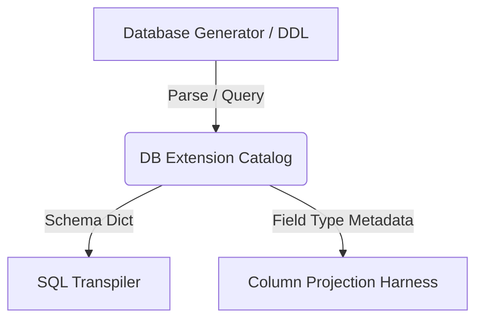

# DB Extension Plan: Dynamic Schema Extraction & Catalog Module

This document outlines the design and implementation plan for a database extension module (`db_extension`). The goal is to eliminate hardcoded, denormalized schema definitions (such as those in `ssb_workload.py`) and replace them with a dynamic database catalog system that extracts schema metadata directly from generator tools, SQL DDL files, or database catalog tables.

---

## 1. Objectives & Motivating Problem

Currently, the SQL-to-Dafny transpiler and verification harness rely on a hardcoded schema dictionary inside the workload configuration file. This introduces several limitations:
* **Coupling:** The compilation and projection harness is tightly coupled to a static set of columns.
* **Maintenance:** Adding new columns, changing data types, or testing new schemas requires manual code edits in the benchmark script.
* **Lack of Sourcing:** The schema structure is not verified against the actual data generator output, risking mismatches if the generator changes.

### The Proposed Solution
A **DB Extension Module** that dynamically inspects the database files, queries database system catalogs, or parses schema files to automatically build the schema representations required by the transpiler.

---

## 2. Proposed Architecture

The extension will consist of three main components:



### A. Schema Sources
The catalog will support multiple ways of discovering table schemas:
1. **DuckDB Catalog Reader:** Inspects the active DuckDB instance or database file (e.g., querying `INFORMATION_SCHEMA.COLUMNS`).
2. **DDL Parser:** Parses standard SQL DDL files (e.g., `create_flat_table.sql`) using a lightweight parser to extract column definitions.
3. **SSB Data Generator inspector:** Queries or infers schema structures based on the generator tables or metadata output.

### B. Catalog API
A clean, schema-agnostic Python interface to access metadata:
```python
class DatabaseCatalog:
    def __init__(self, database_path: str = None):
        ...
        
    def get_table_schema(self, table_name: str) -> dict[str, str]:
        """Returns column names mapped to types (e.g. {'LO_QUANTITY': 'int'})"""
        ...
        
    def get_primary_keys(self, table_name: str) -> list[str]:
        ...
```

---

## 3. Implementation Steps

### Phase 1: DDL and System Catalog Extraction
* Create the `db_extension/` directory.
* Implement a DuckDB catalog reader that runs a query like:
  ```sql
  SELECT column_name, data_type 
  FROM information_schema.columns 
  WHERE table_name = 'lineorder_flat';
  ```
* Fall back to parsing the original SQL DDL script if the DuckDB instance is not active.

### Phase 2: Schema-Agnostic Harness Integration
* Update `harness.py` to initialize the `DatabaseCatalog`.
* Retrieve schema types dynamically at runtime:
  ```python
  from db_extension import DatabaseCatalog
  catalog = DatabaseCatalog()
  schema = catalog.get_table_schema("lineorder_flat")
  ```

### Phase 3: Support for Multi-Table / Normalized Schemas
* Extend the catalog to map foreign keys and primary keys.
* Prepare for the next step of transpiler evolution: supporting SQL joins and multi-table queries by exposing normalized schema relations to the transpiler.

---

## 4. Data Format Engineering & Verification Sourcing

When executing query code compiled from Dafny, data layout is the primary performance bottleneck. This section details how the data formats are extracted, mapped, and structured to achieve maximum CPU cache efficiency and autovectorization.

### A. Denormalized Database Generation via DuckDB
Rather than maintaining static schema files, DuckDB can be used to generate the denormalized flat SSB table dynamically from the output of `ssb-dbgen`:
1. Compile and run `ssb-dbgen` to generate normalized `.tbl` CSV files (`lineorder.tbl`, `customer.tbl`, etc.).
2. Load these tables into an in-memory DuckDB instance.
3. Construct the flat denormalized table `lineorder_flat` using a flat SQL JOIN:
   ```sql
   CREATE TABLE lineorder_flat AS 
   SELECT * FROM lineorder 
   JOIN customer ON lo_custkey = c_custkey 
   JOIN supplier ON lo_suppkey = s_suppkey 
   JOIN part ON lo_partkey = p_partkey 
   JOIN date ON lo_orderdate = d_datekey;
   ```
4. Query DuckDB's `information_schema.columns` to extract column types and dynamically output the schema definitions to the transpiler.

### B. High-Performance Columnar Memory Layout
Dafny's native compilation format uses `Sequence<Rc<Row>>`. Iterating over this structure inside the timed execution block results in severe pointer-chasing and CPU cache misses.

To achieve sub-100 microsecond latency, the compilation harness post-processes the compiled Rust code to use **OnceLock Column Projections**:
1. **OnceLock Allocation:** Column projections are stored in static `OnceLock<Vec<T>>` structures initialized once during data loading (outside the query timer).
2. **Column Type Mapping:**
   * Integer columns are stored as flat, contiguous `Vec<u32>` or `Vec<u64>` to enable LLVM loop autovectorization (using SIMD instructions).
   * String columns (represented as `Sequence<DafnyChar>` in Dafny) are **not** thread-safe (`!Send`/`!Sync`) because they contain `Rc` references under the hood. They cannot be stored in static `OnceLock` structures.
3. **Thread-Safe String Conversion:** String columns are converted at load time to native Rust `String` objects using:
   ```rust
   // DafnyChar (tuple struct wrapping char) converted to native char iterator
   r.FIELD().to_array().iter().map(|c| c.0).collect::<String>()
   ```
   This resolves the thread-safety issues, allowing columns like `P_BRAND` to be stored in static vectors and compared using native Rust string slice operations (`==`).

---

## 5. Harness Optimization Context (For Future Iterations)

When optimizing the generated query code, the optimization agent and compiler passes should apply the following transformation patterns:

### A. Scalar SUM Queries
* Convert local variable types and returns from `DafnyInt` (which uses heap-allocated arbitrary-precision integers) to native primitive type `u64`.
* Convert the iteration loop from index lookups (`data.get_usize(i)`) to index offsets on the static columnar vectors (`col_FIELD[i]`).

### B. GROUP BY and Map Queries
* **Map Optimization:** Replace the functional `dafny_runtime::Map` (which clones the entire map on every update, yielding $O(N^2)$ complexity) with a native, mutable `std::collections::HashMap` for $O(1)$ amortized insertion and update.
* **HashMap Updates:** Rewrite functional index updates into native Rust entry API updates:
   ```rust
   // BEFORE: res = res.update_index(&key, &((if res.contains(&key) { ... }) + val))
   // AFTER:  *res.entry(key.clone()).or_insert(0) += val as u64;
   ```
* **Tuple Key Mapping:** For compound group-by keys (e.g. `(D_YEAR, P_BRAND)`), map the key elements to `(u32, String)` using the projected string column values to avoid runtime character sequence clones.
